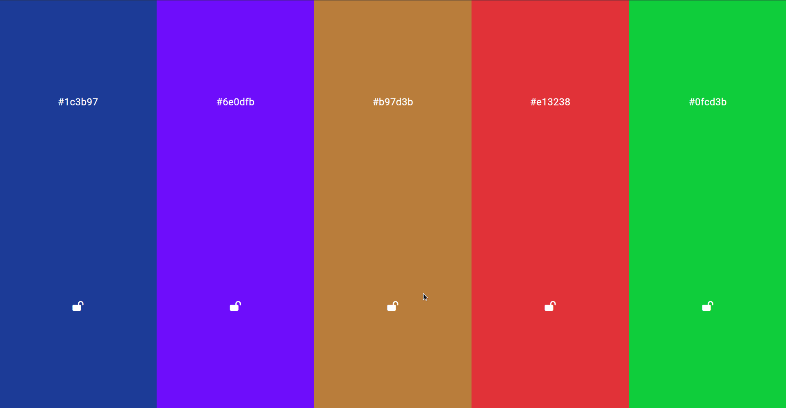

# Colors

## A brief description
Colors is a simple application for creating and selecting a color palette, developed based on HTML5, CSS3 and JS technologies.
No additional settings are required. Allows you to randomly generate a palette of colors KEY:SPACE.
Pin the color you like is a button with a lock in the application interface.
Copy the color to the clipboard - a button with a hexadecimal code.
And also a set of all color codes of the palette is displayed in the browser's address bar.

## Install
You can install the script by cloning/downloading this repository and running Live Server in VS Code.
It is also possible to pull the image from the docker hub [ docker pull alekstar79/colors ] and run
[ docker run -d -p 80:80 --rm --name colors alekstar79/colors ].
For ease of use, a Makefile has been created with short commands [ pull, run, stop ].
Or just open the index file [ index.html ] in any browser.

